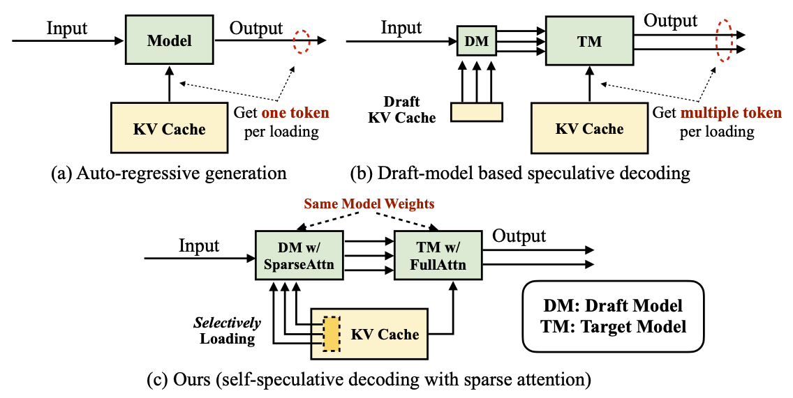
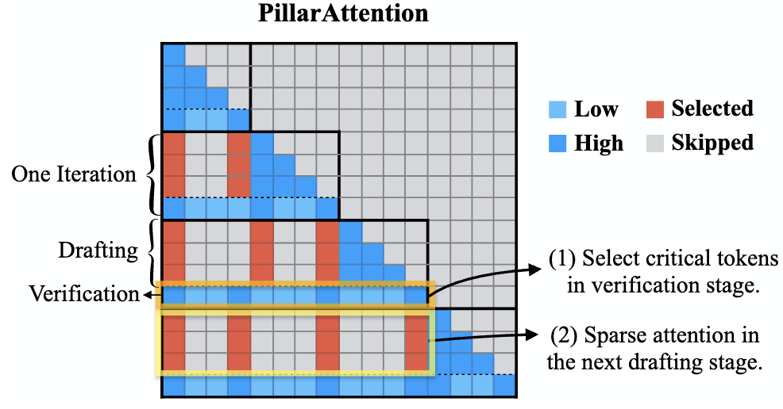
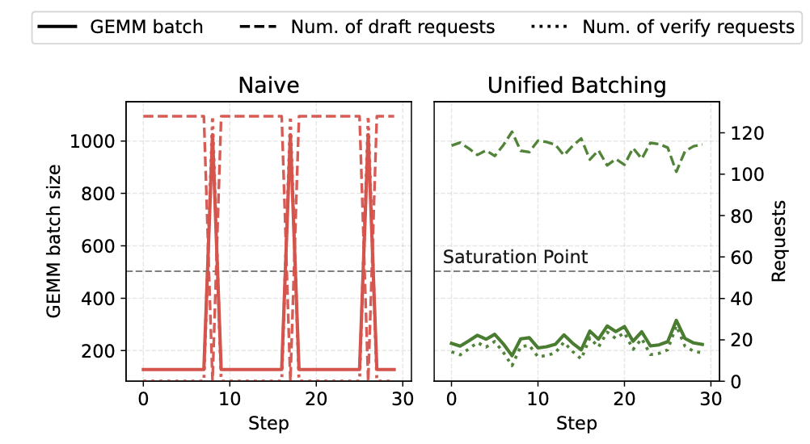
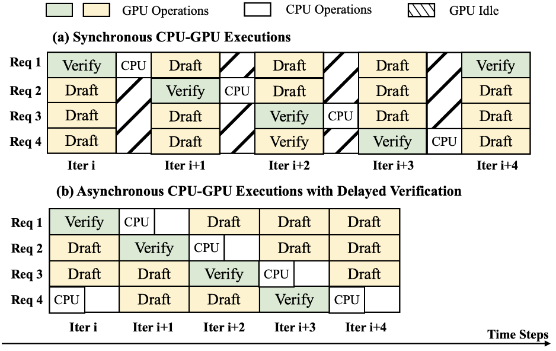
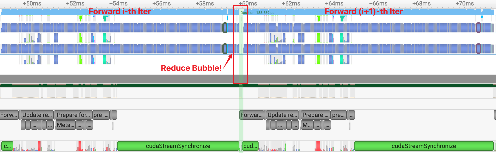
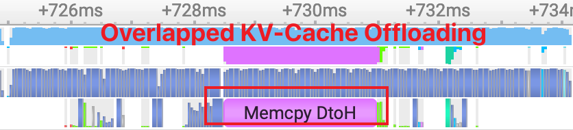

# SparseSpec
> This repo is the proof-of-concept of our research project, which is not yet ready for production use.
> We plan to upstream a subset of features to vLLM in the future.

SparseSpec is a *training-free* and *lossless* acceleration framework for batch inference of reasoning large language models (RLMs), powered by *sparse self-speculative decoding*.
By co-designing dynamic sparse attention with the speculative decoding, SparseSpec achieves up to $2.3\times$ throughput gain on popular workloads such as RL rollout and batch inference over AIME, LivecodeBench, and OlympiadBench.

<p align="center" width="70%">
  
</p>

## Supported Features
- [x] CUDA Graph
- [x] Chunked prefill
- [x] KV-Cache offloading
- [x] Temperature sampling
- [x] Asynchronous CPU scheduling


## Key Techniques (click to expand)
<details>
<summary>
<span style="font-size:1.2em; font-weight:bold;">
Dynamic sparse attention tailored for speculative decoding
</span></summary>

Motivated by the observation that *memory-bound decode attention* is the dominant bottleneck in RLMs inference, SparseSpec uses sparse attention as *draft model* followed by a full attention as *target model*, which dramtically reduces the memory loading thus boosts the throughput (consider check [H2O](https://arxiv.org/abs/2306.14048) and [Quest](https://arxiv.org/abs/2406.10774) if not familiar with sparse attention).
Thus, an accurate and efficient sparse attention mechanism is crucial for SparseSpec.


<p align="center" width="70%">
  
</p>


To improve accuracy, SparseSpec introduces PillarAttn, which periodically updates the sparsity patterns (i.e., crucial tokens), to adapt to the *context dynamics* of the RLMs' long-generation paradigm.
To avoid additional storage overhead (e.g., storing KV-Cache metadata) and computational overhead, SparseSpec co-designs the identification of sparsity patterns with the speculative decoding.
Specifically, SparseSpec leverages the intermidates results of the full attention from verification phase (i.e., every $k$ draft phases), to obtain the crucial tokens with Top-K attention scores.
We visualize this process in the figure above.


</details>

<details>
<summary>
<span style="font-size:1.2em; font-weight:bold;">
Unified batch scheduler
</span></summary>

#### Resource usage fluctuation
Draft and verify phases in sparse self-speculation have heterogeneous resource usages.
Specifically, draft requests lead to $1$ input token while verify requests have $(k+1)$ input tokens.
Besides, draft requests use sparse attention, with a sparsity up to $5$% over KV-Cache, while verify requests use full attention.
Such heterogenity leads to resource usage fluctuation if both phases are scheduled in sequential manner, as visualized in the below figure.

<p align="center" width="65%">
  
</p>

To mitigate this issue, SparseSpec introduces a *unified batch scheduler* to collocate draft and verify requests within a batch, and balance the resource usages across iterations.
This is feasible as the sparse and full attention essentially share the same control and data flow, except for the sparse loading over KV-Cache, which can be easily manipulated by the PageAttention.
Check `serve/scheduler/spec_scheduler.py L68` for detailed implementation.

#### Fused draft and verify attention
To increase bandwidth utilization, SparseSpec introduces a customized attention kernel that automatically dispatches tiles from draft and verify to the best kernel configuration via a persistent kernel style.
Such a fused prefill/decode attention also benefit the CUDA graph capture since a single graph can cover different combination of prefill and decode configurations.
We upstreamed this kernel to FlashInfer in [#1137](https://github.com/flashinfer-ai/flashinfer/pull/1137) and [#1200](https://github.com/flashinfer-ai/flashinfer/pull/1200).


</details>

<details>
<summary>
<span style="font-size:1.2em; font-weight:bold;">
Delayed verification enabling asynchronous CPU/GPU
</span></summary>

#### Delayed verification

In standard speculative decoding, each draft depends on the previous verification step to evict rejected tokens and update token-ID metadata.
Because of this dependency, the next draft iteration cannot begin until the host finishes verification, leaving the GPU idle.
SparseSpec resolves this by extracting verification requests from the batch and deferring them to the next iteration, allowing the remaining requests to proceed without waiting.
The overall workflow is illustrated in the figure below.

<p align="center" width="60%">
  
</p>

#### CUDA graph double buffering

CUDA graphs require fixed workspace buffers, which prevents concurrently reusing the same buffer across consecutive iterations to avoid race condition.
This create a synchronization bubble to wait for the previous graph to finish.
SparseSpec eliminates this gap with a double-buffered CUDA graph scheme:
it maintains two identical graphs, each backed by its own workspace, allowing one graph to run while the other is being prepared.
This is practical because the fused attention kernel significantly reduces the number of CUDA graphs, keeping memory usage manageable.
An nsys profile is shown below:

<p align="center" width="90%">
  
</p>

</details>

<details>
<summary>
<span style="font-size:1.2em; font-weight:bold;">
Chunk-wise and asynchronous CPU KV-Cache offloading
</span></summary>

#### Chunk-wise and asynchronous offloading

To keep offloading off the critical path, SparseSpec performs KV-Cache offloading asynchronously in a separate CUDA stream. Since each iteration only produces a bounded number of tokens (limited by the GEMM batch size), the amount of data needing offload per step is also bounded. This makes chunk-wise offloading feasible, and SparseSpec implements it with a simple PyTorch API, shown below.
```python
def offload(self, idx_gpu, idx_cpu):
    self._physical_mem_cpu[idx_cpu[0] : idx_cpu[-1] + 1, ...].copy_(
        self._physical_mem_gpu[:, idx_gpu, ...].transpose(0, 1), non_blocking=True
    )

def restore(self, idx_cpu, idx_gpu):
    self._physical_mem_gpu[:, idx_gpu, ...] = (
        self._physical_mem_cpu[idx_cpu[0] : idx_cpu[-1] + 1, ...]
        .to(self.device, non_blocking=True)
        .transpose(0, 1)
    )
```

#### Physical and logical page indices conversion

SparseSpec also offloads the page indices that encode the sparsity pattern of draft attention.
Because physical device pages are freed and reassigned after offloading, these indices must be converted into logical (virtual) indices that remain consistent across the sequence.
SparseSpec performs this conversion incrementally using binary search, amortizing the cost across chunks.
The detailed implementation can be found in `serve/request/kv_cache_ptr/base.py L17`.

<p align="center" width="65%">
  
</p>

</details>

## File Structure
```
SparseSpec
├── 3rdparty             # dependencies libraries
├── assets               # figures in README.md
├── eval                 # accuracy evaluation suite
├── scripts              # reproduction scripts
├── serve                # framework implementation
│   ├── attention        # attention kernels
│   ├── distribute       # TP-related utilities
│   ├── model            # modeling wrappers
│   ├── request          # KV-Cache wrappers
│   ├── sampling         # (rejection) sampling
│   ├── scheduler        # unified batch scheduler
│   ├── tests            # unit tests and benchmarks
│   ├── profiler.py
│   ├── run.py           # main entry
│   └── utils.py
```

## Installation
### Create conda environment (optional)
```
conda create -n SparseSpec python=3.12 -y
conda activate SparseSpec
conda install cmake -y
```

### Install dependencies
```
set -euo pipefail
dir=$(pwd)

# pull submodules
git submodule update --init --recursive

# install benchmark suite
cd $dir/eval/benchmarks/latex2sympy
pip install -e .
cd ..
pip install -r requirements.txt

# install custom vLLM fork for MagicDec and Triforce
cd $dir/3rdparty/vllm
export VLLM_USE_PRECOMPILED=1
pip install -e .

# install SparseSpec-python package
cd $dir
pip install -e .

# install customized flashinfer
cd $dir/3rdparty/flashinfer
pip install --no-build-isolation --verbose --editable .

# install raft header-only lib
cd $dir/3rdparty/raft
./build.sh libraft
```

Note that FlashInfer is installed with customized version. Please uninstall your own version.
Once installed, all kernels (including Top-K and attention score rematerialization) are JIT-compiled in `~/.cache/flashinfer/`.


## Scripts
### Prerequisites
We test and evaluate our framework on NVIDIA H100-SXM5 GPUs. CUDA and PyTorch versions do not have strict requirements, while we use CUDA 12.9 and PyTorch 2.8.0.

### Examples and profile scripts
We provide demonstration examples in `scripts/example_single.sh` for running SparseSpec with different configurations.
We provide a nsys profile results for demonstration in `assets/traces/pillar_stride8_my_profile.nsys-rep`. For profiling, to enable nsys profile, please cancel the comment of `${NSYS_CMD[@]}` in scripts:
```bash
nsys profile --cuda-graph-trace node --trace=cuda,nvtx,osrt ...
```
To enable torch profiler for tracing CPU stack, please add a CLI arg `--enable-torch-profiler` when launching `serve/run.py`. Detailed profiler configuration can be found and modified in `serve/scheduler/scheduler.py`:
```python
self.prof = Profiler(
    tag="schedule",
    enable=kwargs["enable_torch_profiler"] and is_first_rank(),
    wait=4480,
    warmup=10,
    active=40,
    repeat=1,
    result_dir=kwargs["profiler_result_dir"],
)
```
### Reproduction

After completing the installation steps above, you can reproduce all reported results with the following scripts.
All scripts evaluate **Qwen3-1.7B / 8B / 14B** on the same 3 math / coding datasets (`aime24`, `livecodebench`, `olympiadbench`).

- **SparseSpec (ours)** – sparse self-speculative decoding engine  
  ```bash
  bash scripts/eval_SparseSpec.sh
  ```  
  Uses SparseSpec with `kv_cache=pillar`, delayed verification and unified scheduler; outputs are written under `eval/benchmarks/outputs/SparseSpec/`.

- **vLLM greedy baseline** – standard full KV-cache decoding  
  ```bash
  bash scripts/eval_vllm.sh
  ```  
  Runs vLLM without speculation, matching SparseSpec’s prompts (`qwen3-math-thinking`) and temperatures; outputs go to `eval/benchmarks/outputs/vllm/`.

- **vLLM + n-gram speculation baseline**  
  ```bash
  bash scripts/eval_vllm_ngram.sh
  ```  
  Enables vLLM’s built-in n-gram speculative decoding on the same 3×3 (models×datasets); outputs go to `eval/benchmarks/outputs/vllm_ngram/`.

- **vLLM + EAGLE3 speculation baseline**  
  ```bash
  bash scripts/eval_vllm_eagle3.sh
  ```  
  Uses vLLM’s EAGLE3 draft models (configured via `DRAFT_MODELS` in the script) on the same 3×3 grid; outputs go to `eval/benchmarks/outputs/vllm_eagle3/`.

- **vLLM MagicDec-style baseline**  
  ```bash
  bash scripts/eval_vllm_magicdec.sh
  ```  
  Enables vLLM V1 self-speculative decoding (`self_specs`) with a configuration aligned with MagicDec; outputs go to `eval/benchmarks/outputs/vllm_magicdec/`.

- **vLLM TriForce-style baseline**  
  ```bash
  bash scripts/eval_vllm_triforce.sh
  ```  
  Runs vLLM V1 self-spec with n-gram assistance (`self_spec_ngram`) using the same 3×3 evaluation grid; outputs go to `eval/benchmarks/outputs/vllm_triforce_ngram/`.

## Troubleshooting
### Update CMake

If you encounter the `CMake 3.30.4 or higher is required` error:

```
conda install cmake==3.30.4 -y
cmake --version

# If the version is still not 3.30.4, please update PATH to override the cmake path
export PATH=<PATH_TO_CONDA>/envs/SparseSpec/bin:$PATH
```

### Update GCC
If you encounter the `version GLIBCXX_3.4.30 not found` error:

```
# Find all libstdc++.so.6
find / -name "libstdc++.so.6" 2>/dev/null
# Check the GLIBCXX version and find a libstdc++.so.6 with GLIBCXX_3.4.30 in your system
# If no such lib, please update your GCC version
strings <PATH_TO_libstdc++.so.6> | grep GLIBCXX_3.4.30
# Symbolic link to the correct libstdc++.so.6
ln -s <PATH_TO_OK_libstdc++.so.6> <PATH_TO_CONDA>/envs/SparseSpec/lib/libstdc++.so.6
```
<!--
### Optional
```
conda install -y git
conda install -y nvidia/label/cuda-12.4.0::cuda-toolkit
conda install -y nvidia::cuda-cudart-dev
conda install -y pytorch torchvision torchaudio pytorch-cuda=12.4 -c pytorch -c nvidia
``` -->

## Acknowledgments
This codebase utilizes [math-evaluation-harness](https://github.com/ZubinGou/math-evaluation-harness) to evaluate the accuracy over various datasets, including [AIME](https://huggingface.co/datasets/AI-MO/aimo-validation-aime), [GPQA](https://arxiv.org/abs/2311.12022), [LiveCodeBench](https://livecodebench.github.io/), and [OlympiadBench](https://arxiv.org/abs/2402.14008).
Our customized kernels are built upon [FlashInfer](https://github.com/flashinfer-ai/flashinfer) and [RAFT](https://github.com/rapidsai/raft).
We also adopt the customized all-reduce (TP) and rejection-sampling kernel implementations from [vLLM](https://github.com/vllm-project/vllm).
Our design is inspired by and evaluated against [MagicDec](https://github.com/Infini-AI-Lab/MagicDec) and [TriForce](https://github.com/Infini-AI-Lab/TriForce).
We thank the authors for their great works.


## Citation
If you use this codebase, or otherwise found our work valuable, please cite:
```bibtex
@misc{xiao2025optimizingmixtureblockattention,
      title={Optimizing Mixture of Block Attention},
      author={Guangxuan Xiao and Junxian Guo and Kasra Mazaheri and Song Han},
      year={2025},
      eprint={2511.11571},
      archivePrefix={arXiv},
      primaryClass={cs.LG},
      url={https://arxiv.org/abs/2511.11571},
}
```
